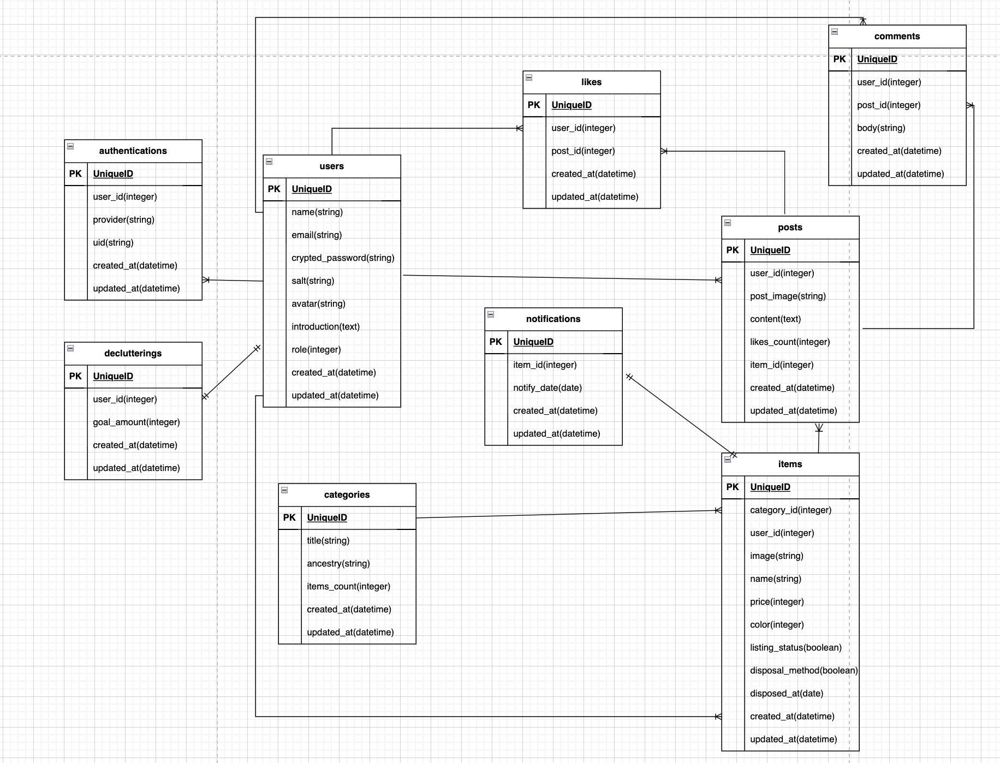

# steteco

## サービス概要
今回のアプリは、不用品の整理をしている際に「もったいないから」「フリマアプリで売れるかもしれないから」と考えてしまい、捨てる決断ができない優柔不断な方向けの、断捨離を後押しするサービスです。

## 想定されるユーザー層
フリマアプリ利用者の方。優柔不断な性格で物が捨てられない方。

## サービスコンセプト
部屋の整理をし不用品が出るたびに、「フリマアプリで売れるかも」と思い、優柔不断な人だとなかなか物が捨てられなくて結局片付きません。

元々私自身も優柔不断な性格で、不用品が出るだびに「もしフリマアプリで売れたらお金になる」と思い、結局物置部屋のものが増えるだけという悪循環を繰り返していました。

そこで、断捨離を後押ししてくれるツールがあれば便利なのではと考えました。
メインの機能としては、LINE通知機能です。
まず、ユーザーには不用品を登録してもらいます。その際に通知日も指定してもらい、その通知日が来たらLINEで断捨離のメッセージを送ります。

また、捨てたものを週間ごとでグラフ化し、断捨離できているかどうかの記録を可視化します。
過去捨てたものは履歴一覧で見れる様にし、過去何を捨てたかわかれば、次回は不必要なものを買うことの防止にもなります。

さらに、「手放したモノ」について投稿できる機能もつけることで、ユーザーが投稿を参考に捨てるものを判断できることも期待できます。

このアプリで、フリマアプリを楽しみながら、優柔不断なユーザーが後悔なくモノを捨てることできるサービスにしていきたいと思っています。

## 実装を予定している機能
### MVP
* LINEログイン
* マイページ
* 投稿機能
* いいね機能
* 断捨離数の目標設定
* 出品中・未出品別の不用品管理
* カテゴリー分け(不用品がどのカテゴリーに属しているか分ける)
* 捨てたものをグラフ化(週間)
* 断捨離したモノ履歴一覧
* 検索機能（オートコンプリート）
* LINE通知
* Xシェア

### その後の機能
* レコメンド機能 (ユーザーの捨てたものの中から、どの様なものがよく買われているけど捨てているのかレコメンド機能を応用して、次回の購入で注意喚起する。)
* 投稿のランキング化 (ログインなしで利用可)
* コメント機能
* 管理機能

### 画面遷移図
https://www.figma.com/file/Zzg6RfUUWUZmRSWMpDLzQs/Untitled?type=design&node-id=0%3A1&mode=design&t=Oh14cjazP605Vgvy-1

### ER図
