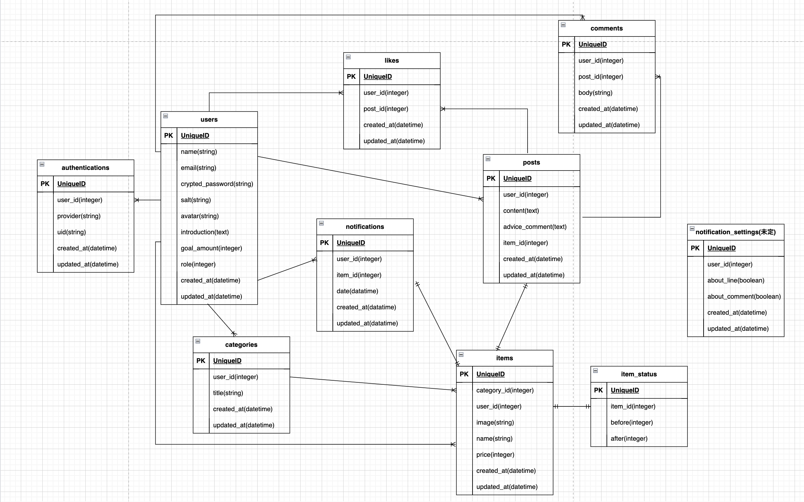

# 「steteco」（仮：サービス名はまだ決まっていません）

## サービス概要
今回のアプリは、不用品の整理をしている際に「もったいないから」「フリマアプリで売れるかもしれないから」と考えてしまい、捨てる決断ができない優柔不断な方向けの、不用品の量を可視化できるサービスです。

## 想定されるユーザー層
フリマアプリ利用者の方。優柔不断な性格で物が捨てられない方。

## サービスコンセプト
部屋の整理をし不用品が出るたびに、「まだ使えるから」「フリマアプリで売れるかも」と思い、優柔不断な人だとなかなか物が捨てられなくて結局片付きません。

元々私自身も優柔不断な性格で、不用品が出るだびに「もしフリマアプリで売れたらお金になる」と思い、結局物置部屋のものが増えるだけという悪循環を繰り返していました。

そこで、不用品の数を積み上げ横棒グラフなどで表して可視化し(イメージ：iphoneストレージ画面とダイエットアプリのカロリー摂取のバーを合わせた感じ)、設定した基準値を超えないように調整していく方向にユーザーの意識を向けるツールがあれば便利なのではと考えました。

また、捨てたものを週間か月間別でグラフ化し、断捨離できているかどうかの記録を可視化します。
過去捨てたものは履歴一覧で見れる様にし、過去何を捨てたかわかれば、次回は不必要なものを買うことの防止にもなります。

さらに、「捨てたモノ」について投稿できる機能もつけることで、ユーザーが投稿を参考に捨てるものを判断できることも期待できます。

このアプリで、優柔不断なユーザーが後悔なくモノを捨てることができ、長期間お部屋に不用品が残りイライラしてしまう状態を解消するためのサービスにしていきたいと思っています。

## 実装を予定している機能
### MVP
* 会員登録
* ログイン
* マイページ
* 投稿機能 (売れると思ったが結局捨てることになったモノについて)
* いいね機能
* 出品中タブ
* 未出品タブ
* カテゴリー分け(不用品がどのカテゴリーに属しているか分ける)
* 不用品をストレージで表し可視化(3つのリストの合計)
* 捨てたものをグラフ化(週間別または月間別)
* 捨てたもの履歴一覧(売却したのか、売れずに捨てたのか)
* 検索機能（検索候補表示→マルチ検索・オートコンプリート）
* LINE通知 (リストで長期間残っているものがある時) 
* SNS投稿

### その後の機能
* レコメンド機能 (ユーザーの捨てたものの中から、どの様なものがよく買われているけど捨てているのかレコメンド機能を応用して、次回の購入で注意喚起する。)
* 投稿のランキング化 (ログインなしで利用可)
* コメント機能
* 管理機能

### 画面遷移図
https://www.figma.com/file/Zzg6RfUUWUZmRSWMpDLzQs/Untitled?type=design&node-id=0%3A1&mode=design&t=Oh14cjazP605Vgvy-1

### ER図
